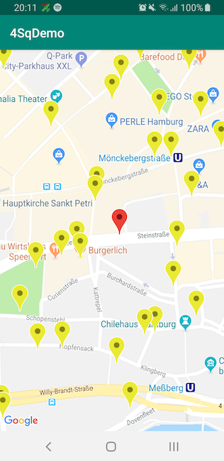
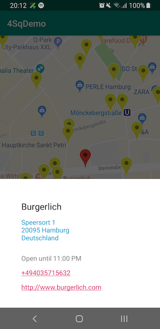

##  Foursquare Places Demo

### Preview

  
   

### Overview
This project is an Android demo client for [Foursquare's Places Api ](https://developer.foursquare.com/docs).
Basic functionality allows you to search on a map for restaurants and open their details. Restaurants are dynamically loaded as user moves on a map.

### Architecture
App utilises Clean architecture and uses feature-based package structure.
Inside it is splits into 3 layers - model, domain and view

*  **Model** -  Responsible for providing required data to business logic. To communicate with this layer there are Repository interfaces which are implemented by UserLocationRepoImpl and FoursquareApiRepoImpl

*  **Domain** -  Contains most of a business logic which is fully written in Rx-Java2. Includes 1 lifecycle-aware Interactor which is responsible for state of the map at any given moment. This logic is completely AndroidFramework-free and is fully tested with Junit.

*  **View** -  Includes code which directly affects ui or touches Android-framework. Consists of Interfaces to talk with other layers, Android ui components and set of State classes each of which represents 1 state of the view and then is mapped by the view to some views properties changes. It's also worth mentioning that ui state changes can only happen by calling 1 method `void updateState(State state)` which greatly improve debugging and makes app less error prone.

### Additional Notes
* App also implements a `buffer zone` around your current viewport. This means that if user doesn't move far on the map - no request needed.
* Detais of a restaurants is a 'premium call' with the restriction of 50 a day. When user hits this limit Api will return with 429 and app tries to show at least basic info in this case.

### Things to improve given more time
* Have proper structure to store Marker objects and hide/show them when needed
* Put more info on details page
* Use custom deserializers and not use gson
